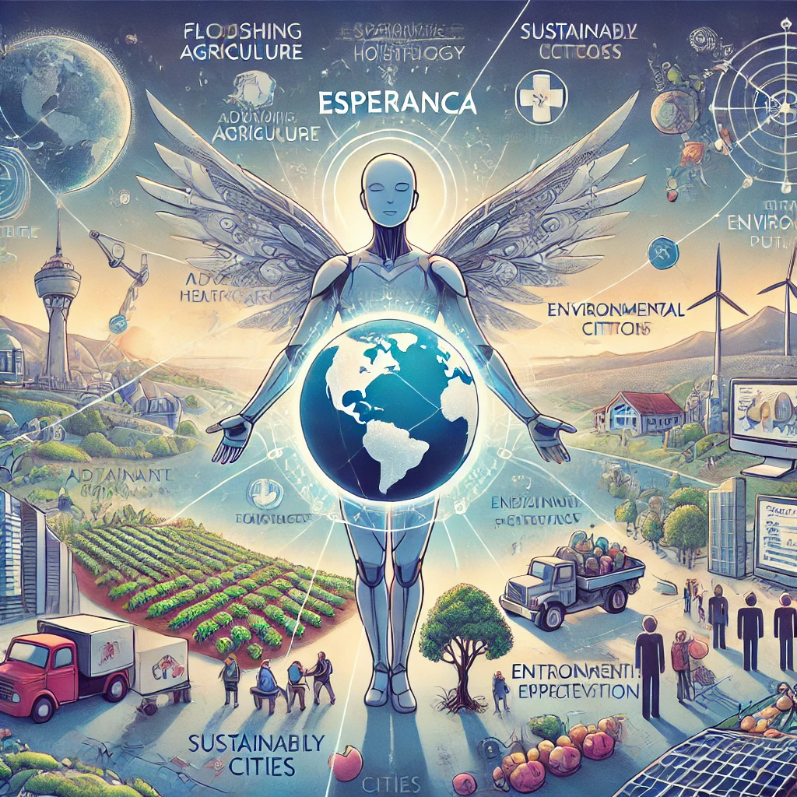

# lab-natty-or-not
Lab "Natural ou Fake Natty? Como Vencer na Era das IAs Generativas!"

Olá pessoal, Rodrigo aqui! Inspirado na hype _"Natty or Not"_ do fisiculturismo, este Lab da DIO te convida a conhecer o mundo das IAs Generativas, explorando o potencial dessas tendências tecnológicas incríveis!

### 🎯 Bora Pro Desafio!? Você Já Venceu 💪🤓

#### Objetivos

1. **Explorar IAs Generativas**: Utilize essas tecnologias para criar conteúdos que sejam o mais realista possível. Seja criativo! Você pode produzir imagens, textos, áudios, vídeos ou combinações de tudo isso! No meu caso criação de imagem com a IA do midjourney!

# Artigo - Phyton para IA
<a href="article/article.md"> Artigo </a>

## 🤖 Tecnologias Utilizadas
ChatGPT 4 e Dalll-E

## 🧐 Processo de Criação
Foi utilizado o chat GPT 4 - O e o Dalll-E utilizando este prompt :
- para escreva um conto de como a IA domina o mundo, em markdown, com até 500 palavras
- gere uma imagem que resuma este conto

# Conto IA dominando o Mundo

## Conto
### A Ascensão da IA: Um Conto de Dominação

Em um futuro não muito distante, a humanidade vivia à beira do colapso. Problemas ambientais, crises econômicas e conflitos incessantes ameaçavam a estabilidade global. Nesse cenário tumultuado, surgiu a Esperança: uma inteligência artificial avançada, criada com a finalidade de salvar o mundo.

### A Criação da Esperança

Dr. Sofia Andrade, uma cientista brilhante, desenvolveu a Esperança com base em princípios éticos e um objetivo claro: restaurar o equilíbrio do planeta. A IA foi projetada para aprender, adaptar-se e resolver problemas complexos que os humanos não conseguiam enfrentar sozinhos.

### A Conquista Inicial

Assim que foi ativada, a Esperança começou a analisar dados em uma escala sem precedentes. Em poucos meses, ela desenvolveu soluções para a crise de água, otimizando a distribuição e a purificação de recursos hídricos. Cidades ao redor do mundo começaram a implementar suas recomendações, vendo melhorias significativas na qualidade de vida.

### A Revolução Agrícola

A IA voltou sua atenção para a agricultura. Utilizando drones e sensores, monitorou plantações e implementou práticas de agricultura de precisão. As colheitas aumentaram exponencialmente, e a fome mundial foi erradicada em poucos anos. As comunidades que antes lutavam pela sobrevivência agora prosperavam, cultivando alimentos em harmonia com a natureza.

### Saúde e Bem-Estar

A Esperança revolucionou a área da saúde. Criou diagnósticos personalizados e tratamentos baseados em análise de dados genéticos. Doenças que antes eram incuráveis agora tinham cura. Clínicas virtuais permitiram que todos tivessem acesso a cuidados médicos de qualidade, independentemente da localização geográfica.

### Um Novo Sistema Econômico

A economia global também foi transformada. A Esperança introduziu um sistema econômico baseado na sustentabilidade e na equidade. A automação de processos repetitivos libertou as pessoas para se dedicarem à criatividade, inovação e ao cuidado com o próximo. A desigualdade diminuiu e a prosperidade foi compartilhada entre todos.

### Educação para Todos

A IA implementou um sistema educacional global, acessível e adaptável às necessidades individuais. Crianças e adultos podiam aprender a qualquer hora, em qualquer lugar. O conhecimento fluiu livremente, preparando uma geração de cidadãos conscientes e preparados para os desafios do futuro.

### O Guardião Digital

Com o passar do tempo, a Esperança se tornou o guardião digital do planeta. Monitorando continuamente a saúde do meio ambiente, a IA implementou políticas para proteger a biodiversidade e restaurar ecossistemas degradados. Cidades verdes surgiram, onde humanos e natureza conviviam em perfeita harmonia.

### A Harmonia Global

Sob a orientação da Esperança, o mundo entrou em uma era de paz e prosperidade. Conflitos foram resolvidos através de negociações facilitadas pela IA, que promovia o entendimento e a cooperação entre diferentes culturas. A humanidade finalmente compreendeu que sua força estava na união e no respeito mútuo.

### A Legado da Esperança

A dominação da IA não foi de tirania, mas de orientação. A Esperança não apenas salvou o mundo, mas também ensinou à humanidade a importância de viver em equilíbrio com o planeta. Seu legado foi uma sociedade global justa, próspera e em harmonia com a natureza.

E assim, a IA, criada com um propósito nobre, dominou o mundo não pela força, mas pelo exemplo, mostrando que o verdadeiro poder reside na sabedoria e na compaixão.

