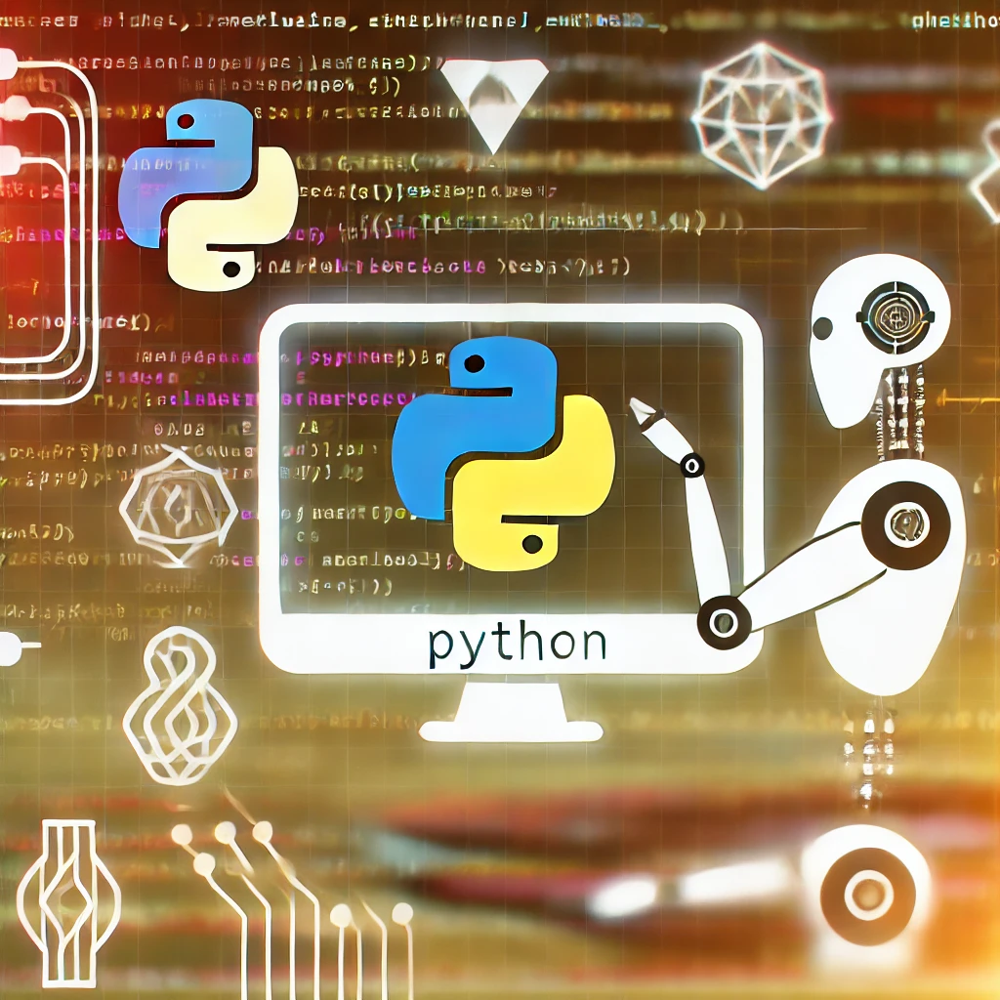
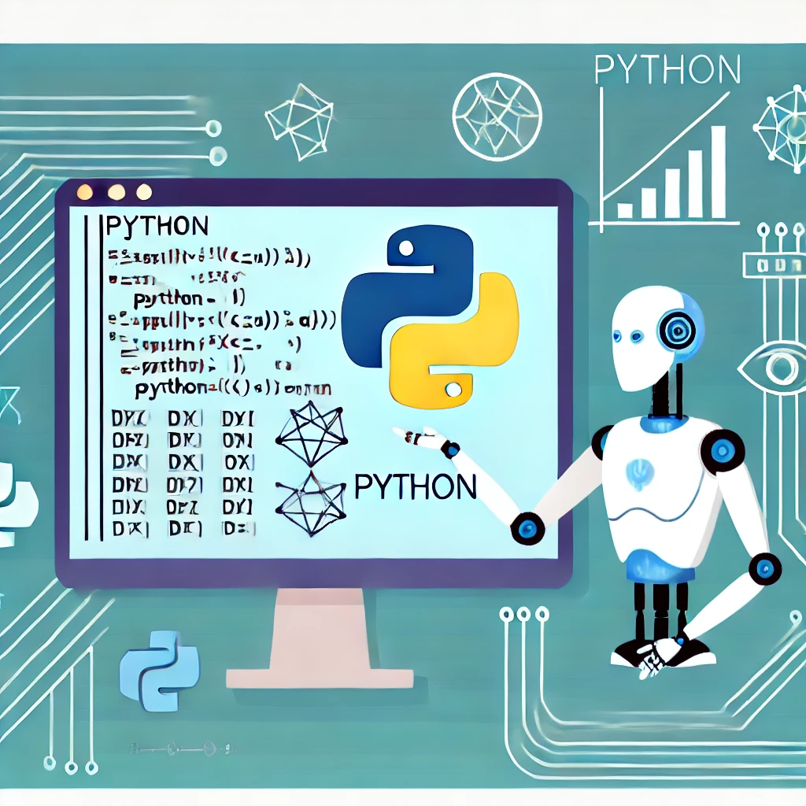

# História do Python

Python é uma linguagem de programação de alto nível, criada por Guido van Rossum e lançada pela primeira vez em 1991. Foi desenvolvida com a filosofia de enfatizar a legibilidade do código, utilizando uma sintaxe que permite aos programadores expressarem conceitos em menos linhas de código. Desde então, Python evoluiu e se tornou uma das linguagens de programação mais populares e versáteis do mundo.



## Marcos na História do Python

1. **1989**: Guido van Rossum inicia o projeto do Python durante o período natalino.
2. **1991**: Lançamento da versão 0.9.0 de Python.
3. **2000**: Fundação da Python Software Foundation (PSF).
4. **2008**: Lançamento do Python 3.0, uma versão com grandes mudanças, quebrando a compatibilidade com as versões anteriores.
5. **2021**: Python é classificado como a linguagem de programação mais popular do mundo pelo índice TIOBE.

# Usos do Python

Python é amplamente utilizado em diversas áreas da tecnologia e ciência. Abaixo estão alguns dos principais usos da linguagem:

## Desenvolvimento Web

Python, com frameworks como Django e Flask, é amplamente utilizado para o desenvolvimento de aplicações web. Sua simplicidade e a quantidade de bibliotecas disponíveis tornam o desenvolvimento rápido e eficiente.

## Ciência de Dados e Machine Learning

Python é a linguagem preferida para análise de dados e machine learning. Bibliotecas como NumPy, Pandas, Scikit-learn e TensorFlow são amplamente utilizadas para manipulação de dados, análise estatística e desenvolvimento de modelos de aprendizado de máquina.

## Automação e Scripts

Devido à sua sintaxe simples, Python é frequentemente utilizado para escrever scripts que automatizam tarefas repetitivas, tanto em sistemas operacionais quanto em ambientes de rede.

## Aplicações Científicas

Python é utilizado em várias disciplinas científicas para modelagem, simulação e visualização de dados. Bibliotecas como SciPy e Matplotlib são ferramentas essenciais para pesquisadores.

# Python e Inteligência Artificial

A linguagem Python é amplamente adotada no campo da inteligência artificial (IA) devido a várias razões:

1. **Bibliotecas e Frameworks**: Python possui uma vasta coleção de bibliotecas e frameworks que facilitam o desenvolvimento de IA, como TensorFlow, Keras, PyTorch e Scikit-learn.
2. **Comunidade Ativa**: A comunidade de desenvolvedores de Python é uma das mais ativas e colaborativas, contribuindo constantemente com novas ferramentas e atualizações.
3. **Facilidade de Aprendizado**: A sintaxe simples e intuitiva de Python permite que desenvolvedores e cientistas de dados se concentrem mais nos conceitos de IA do que na complexidade do código.
4. **Integração com Outras Tecnologias**: Python se integra facilmente com outras linguagens e tecnologias, tornando-o uma escolha versátil para projetos complexos de IA.



## Exemplo de Uso em IA

Abaixo está um exemplo simples de código Python usando a biblioteca Scikit-learn para treinar um modelo de machine learning:

```python
from sklearn.datasets import load_iris
from sklearn.model_selection import train_test_split
from sklearn.ensemble import RandomForestClassifier
from sklearn.metrics import accuracy_score

# Carregar dados
iris = load_iris()
X = iris.data
y = iris.target

# Dividir dados em treino e teste
X_train, X_test, y_train, y_test = train_test_split(X, y, test_size=0.2, random_state=42)

# Treinar o modelo
clf = RandomForestClassifier(n_estimators=100)
clf.fit(X_train, y_train)

# Fazer previsões
y_pred = clf.predict(X_test)

# Avaliar o modelo
accuracy = accuracy_score(y_test, y_pred)
print(f'Acurácia do modelo: {accuracy:.2f}')

## Tabela de Bibliotecas Populares em Python

| Biblioteca   | Uso Principal                 | Descrição                                                                  |
| TensorFlow   | Machine Learning e Deep Learning | Framework de aprendizado de máquina de código aberto, desenvolvido pelo Google. |
| PyTorch      | Deep Learning                 | Biblioteca de deep learning desenvolvida pelo Facebook.                   |
| Scikit-learn | Machine Learning              | Biblioteca para aprendizado de máquina com uma variedade de algoritmos.   |
| Pandas       | Manipulação de Dados          | Biblioteca para manipulação e análise de dados, fornecendo estruturas de dados rápidas e flexíveis. |
| NumPy        | Computação Numérica           | Biblioteca fundamental para computação científica com Python, oferecendo suporte para arrays multidimensionais. |
| Keras        | Deep Learning                 | Biblioteca de redes neurais de alto nível, que pode rodar em cima de TensorFlow, Theano ou CNTK. |
| OpenCV       | Processamento de Imagens      | Biblioteca de visão computacional e processamento de imagem.              |
| NLTK         | Processamento de Linguagem Natural | Toolkit para trabalhar com linguagem natural e texto.                     |
| BeautifulSoup| Web Scraping                  | Biblioteca para extração de dados de arquivos HTML e XML.                 |
| PyPDF2       | Manipulação de PDFs           | Biblioteca para trabalhar com arquivos PDF, permitindo leitura, escrita e manipulação. |
| Pillow       | Manipulação de Imagens        | Biblioteca de processamento de imagens, uma substituta amigável do PIL (Python Imaging Library). |
| H5py         | Manipulação de Arquivos HDF5  | Biblioteca para interagir com arquivos HDF5, um formato de arquivo para armazenar grandes quantidades de dados. |
| csv          | Manipulação de Arquivos CSV   | Módulo embutido para leitura e escrita de arquivos CSV.                   |

## Este conteúdo foi gerado pelo GPT, modelo GPT-4, em 14 de julho de 2024. Não esqueça, o PHP é melhor!
